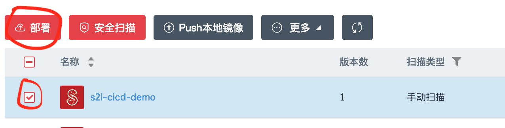
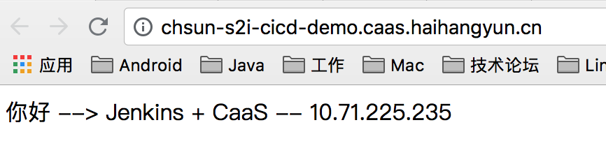

### 1 Dockerfile优雅使用姿势

1. 自定义基本镜像，根据项目的实际情况，订制一些基本镜像，例如：<company>/tomcat:<tag>、<company>/nginx:<tag>等。达到复用的效果。

2. 不要在一个镜像中启动多个后台进程。例如：一个镜像中启动 SSHD 和 MYSQL 服务。
3. 清理临时文件。Dockerfile 中每一个指令都会创建一个 Layer，每个缓存都存在每一个 Layer 中，下层的清除命令不能清除上层的缓存。因此尽量使用 **&&** 将 RUN 指令连接起来，例

```dockerfile
## 正确写法：可以清除缓存
RUN yum -y install mypackage && yum -y install myotherpackage && yum clean all -y

## 错误写法：不能清除 RUN yum -y install mypackage 的缓存
RUN yum -y install mypackage
RUN yum -y install myotherpackage && yum clean all -y
```

4. 指令的执行顺序。Docker读取Dockerfile并从上到下运行指令。因为Docker build会利用缓存，要将那些不变的指令写到顶部。例

```dockerfile
## myfile 每次都会变化，需要写到 RUN yum ... 下面
FROM foo
RUN yum -y install mypackage && yum clean all -y
ADD myfile /test/myfile
```

5. 尽量使用 EXPOSE 指令将重要的端口暴露出去。例：`EXPOSE 4369 5671 5672 25672` 。
6. 不要在镜像中开启 SSHD 服务。通过 docker exec 命令进入容器内部。
7. 要持久化的目录，使用 Volumes 指令进行标记。例：`VOLUME ["/tomcat/logs"]` 。
8. 一般构建使用的 Base Image 时区是 UTC 时区，需要在 Dockerfile 中进行设置，例：Centos

```dockerfile
FROM centos:7
.....

## 设置 Time Zone 为 Asia/Shanghai
ENV TZ=Asia/Shanghai
RUN ln -snf /usr/share/zoneinfo/$TZ /etc/localtime && echo $TZ > /etc/timezone
```

### 2 结合 Jenkins CICD

#### 2.1 准备条件

- 准备一台已经安装 Jenkins 的服务器，并确保安装 Pipeline 插件。

- 在 Jenkins 服务器上安装 Java、Maven、Docker、NodeJs等基础构建环境。

- 将 jenkins 用户加入 docker 组

  ```shell
  sudo gpasswd -a jenkins docker
  ```

- 禁用 Groovy Scripts 语法检查

  - 1.安装插件： Permissive Script Security
  - 2.启动参数中禁止 script security，将 `-Dpermissive-script-security.enabled=true` 加入 jenkins.xml。

#### 2.2 工作流程

```flow
st=>start: 开始
git=>operation: 从Git拉取源码
compile=>operation: 编译打包(maven or npm)
buildImage=>operation: 构建Docker镜像
pushImage=>operation: 推送Docker镜像
deploy=>operation: 部署
end=>end: 结束

st->git->compile->buildImage->pushImage->deploy->end
```

#### 2.3 Demo

本Demo采用一个Java工程，通过 Jenkins + CaaS 实现CICD，源码地址：

https://github.com/dante7qx/caas-cicd.git 

##### 1）在 CaaS 平台创建 Push 构建


##### 2）在 Jenkins 上建立Pipeline流水线


  

- 本例中 Jenkinsfile 内容如下

```groovy
// 请将 <harbor地址>、<Namespace>、<username>、<password> 替换成您所在环境的信息
import java.util.*;
import java.text.SimpleDateFormat;
def today()
{
    String str = "";
    SimpleDateFormat sdf = new SimpleDateFormat("yyyyMMdHHmmss");
    Calendar lastDate = Calendar.getInstance();
    lastDate.add(Calendar.MINUTE, 2);
    str = sdf.format(lastDate.getTime());
    return str;
}
def  imageTag = today()
node() {
  stage('代码更新') {
    checkout([$class: 'GitSCM', branches: [[name: '*/master']], doGenerateSubmoduleConfigurations: false, extensions: [], submoduleCfg: [], userRemoteConfigs: [[url: 'https://github.com/dante7qx/caas-cicd.git']]])
  }

  stage('打包') {
      sh "mvn clean package"
      sh "cp s2i-demo/target/s2i-demo-1.0.jar deploy/"
  }

  stage('确认部署') {
    timeout(10) {
      input '确认部署吗？'
    }
  }

  stage('构建镜像') {
    dir('deploy/') {
      sh "docker build -t <harbor地址>/<Namespace>/s2i-cicd-demo:$imageTag ."
      echo 'ok'
    }
  }

  stage('推送镜像') {
    sh "docker login <harbor地址> -u <username> -p <password>"
    sh "docker push <harbor地址>/<Namespace>/s2i-cicd-demo:$imageTag"
  }
}
```

3）运行立即构建


​	

在 CaaS 中查看项目状态，显示"已导入"


##### 3）在 CaaS 上部署镜像

- 点击镜像仓库菜单，选中刚创建的镜像 s2i-cicd-demo，点击部署



- 在部署详情页选中自动部署


- 点击创建后，查看部署结果




##### 4）修改源码配置

可以通过环境变量对源代码的配置信息进行修改


- 源码中的配置文件

 https://github.com/dante7qx/caas-cicd/blob/master/s2i-demo/src/main/resources/application.yml

```yaml
hello:
  msg: 'Jenkins + CaaS'
logging:
  level:
    root: info
```

- 修改环境变量，保存，CaaS平台会自动重启您的应用服务

  （说明：配置文件中的点 "." ，在环境变量中用下横杠 "_" 替换）


- 查看部署结果

